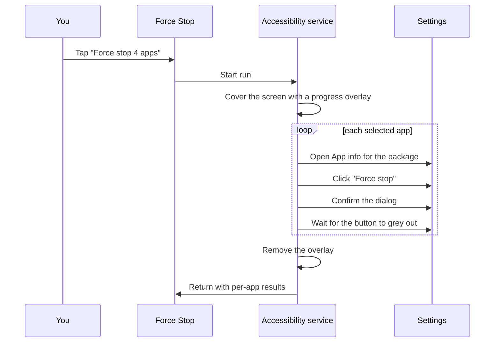

# Force Stop

One tap to force-stop a list of apps you rarely open.

Some apps go quiet until you open them once, then start pushing notifications again for
weeks. Muting their notifications outright is too blunt — you still want to hear from them
when *you* choose to use them. The manual fix is Settings → Apps → *app* → **Force stop**,
repeated for every offender.

This app does exactly that, for a list you pick once, behind a single button.

> **Not on Google Play, and not a candidate for it.** Play's accessibility policy only
> permits accessibility services that assist users with disabilities. This one uses the API
> to drive Settings, which is a legitimate thing to do on your own device but is not a
> permitted use for a Play-distributed app. Build it and sideload it.

## How it works

There is no public API for stopping another app. `FORCE_STOP_PACKAGES` is
`signature|privileged`, so a normal app can never hold it. The usual ways around that are
root or Shizuku, both of which need setup outside the app. This takes the fourth route: an
accessibility service that presses the same button you would.



You never see the Settings screens — a full-screen overlay sits on top for the duration,
showing which app is being stopped.

## Requirements

- Android 15 (API 35) or newer
- A device whose Settings app is `com.android.settings` (effectively all mainstream
  Android; see [Other devices](#other-devices))

Developed and tested on Samsung One UI.

## Install

```bash
git clone https://github.com/Kumar-Ashwin-Hubert/android-forceclose.git
cd android-forceclose
./gradlew :app:assembleDebug
adb install -r app/build/outputs/apk/debug/app-debug.apk
```

Or open the project in Android Studio and hit Run.

## Setup

The app shows a card for anything still missing, with a button that takes you to the right
screen. Two things are needed:

| Permission | Why |
| --- | --- |
| **Display over other apps** | Android blocks background apps from launching activities. After the first app, Settings is in the foreground and this app isn't, so opening the next App info page would be refused. Holding `SYSTEM_ALERT_WINDOW` is a [documented exemption](https://developer.android.com/guide/components/activities/secure-bal) to that restriction. |
| **Accessibility service** | Settings → Accessibility → Force Stop. This is what actually reads the App info screen and presses the button. |

Then tick the apps you want, and tap the button. Your selection is remembered.

## Privacy

An accessibility service can, in principle, read everything on screen. This one is
deliberately fenced in:

- **Scoped to Settings.** `android:packageNames="com.android.settings"` in
  [`accessibility_service_config.xml`](app/src/main/res/xml/accessibility_service_config.xml)
  means the system only ever hands it window content from the Settings app. It cannot read
  your messages, your banking app, or anything else.
- **Idle unless you start a run.** `onAccessibilityEvent` does nothing. The service acts
  only when the button is pressed.
- **No network.** The app declares no `INTERNET` permission. There is no analytics, no
  crash reporting, no remote config.
- **No backup.** `allowBackup="false"`, and your app selection stays on the device in
  local DataStore.

It also refuses to click anything it hasn't positively identified:

> **`Uninstall` sits on the same row as `Force stop`.** So the button is located purely by
> matching its visible text, never by view id or screen position, where an OEM layout
> difference could land the tap one button over. The label is read out of the Settings
> app's own string resources, which also makes it work on non-English devices.

## Limitations

- **Force stopping isn't permanent.** The app is gone until something wakes it — a push
  message, an alarm, a scheduled job, or you opening it. This buys you quiet, not a
  permanent block.
- Roughly two seconds per app; the run is sequential because Settings shows one App info
  page at a time.
- Success is confirmed by the Force stop button becoming disabled. On a skin that keeps it
  enabled, or that is unusually slow, you'll get `Tapped "Force stop" but the app never
  stopped` even though it may have worked.
- System apps are hidden by default behind a filter chip. Force stopping the wrong system
  process can make the device misbehave until you reboot.

## Other devices

If your OEM hosts App info somewhere other than `com.android.settings`, add that package to
`android:packageNames` in
[`accessibility_service_config.xml`](app/src/main/res/xml/accessibility_service_config.xml)
and to the `<queries>` block in
[`AndroidManifest.xml`](app/src/main/AndroidManifest.xml).

Timing is tunable at the top of
[`ForceStopAccessibilityService.kt`](app/src/main/java/dev/ashwin/forcestop/service/ForceStopAccessibilityService.kt)
if your device animates slowly.

To see what a failing run is doing:

```bash
adb logcat -s ForceStop:V
```

## Project layout

| File | Role |
| --- | --- |
| [`ForceStopAccessibilityService.kt`](app/src/main/java/dev/ashwin/forcestop/service/ForceStopAccessibilityService.kt) | The run loop: opens each App info page, clicks, confirms, verifies |
| [`SettingsLabels.kt`](app/src/main/java/dev/ashwin/forcestop/service/SettingsLabels.kt) | Reads the real button labels from the Settings package, so it isn't English-only |
| [`NodeMatching.kt`](app/src/main/java/dev/ashwin/forcestop/service/NodeMatching.kt) | Accessibility node lookup helpers |
| [`RunOverlay.kt`](app/src/main/java/dev/ashwin/forcestop/service/RunOverlay.kt) | The full-screen progress panel |
| [`ForceStopController.kt`](app/src/main/java/dev/ashwin/forcestop/service/ForceStopController.kt) | Shared run state between service and UI |
| [`InstalledAppsRepository.kt`](app/src/main/java/dev/ashwin/forcestop/data/InstalledAppsRepository.kt) | Lists launchable apps |
| [`SelectionStore.kt`](app/src/main/java/dev/ashwin/forcestop/data/SelectionStore.kt) | Persists your picks |
| [`AppListScreen.kt`](app/src/main/java/dev/ashwin/forcestop/ui/AppListScreen.kt) | Compose UI, setup prompts, results |

### Two things worth knowing if you fork this

The overlay was the fiddly part, and both problems are easy to lose an afternoon to:

1. **A `SYSTEM_ALERT_WINDOW` overlay cannot cover Settings.** Settings sets
   `HIDE_NON_SYSTEM_OVERLAY_WINDOWS` on its activities as anti-tapjacking protection — the
   overlay simply vanishes when App info opens. The fix is
   `AccessibilityService.attachAccessibilityOverlayToDisplay()`, which the flag doesn't
   apply to.
2. **Attaching an accessibility overlay does not show it.** `SurfaceControl` layers are
   created hidden, and the attach call only reparents. `SurfaceView.setChildSurfacePackage`
   calls `show()` for you; this path doesn't. Without an explicit
   `setVisibility(surface, true)` the attach succeeds, the surface is valid, and nothing
   renders.

## Building

| | Version |
| --- | --- |
| Android Gradle Plugin | 9.4.0 |
| Gradle | 9.7.1 |
| Kotlin | 2.2.10 (via AGP's built-in Kotlin support) |
| compileSdk / targetSdk / minSdk | 37 / 36 / 35 |
| JDK | 17+ |

AGP 9 registers its own `kotlin` extension, so the `org.jetbrains.kotlin.android` plugin is
deliberately *not* applied — only `org.jetbrains.kotlin.plugin.compose`, pinned to the
Kotlin version AGP bundles.
