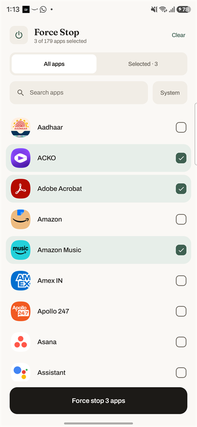
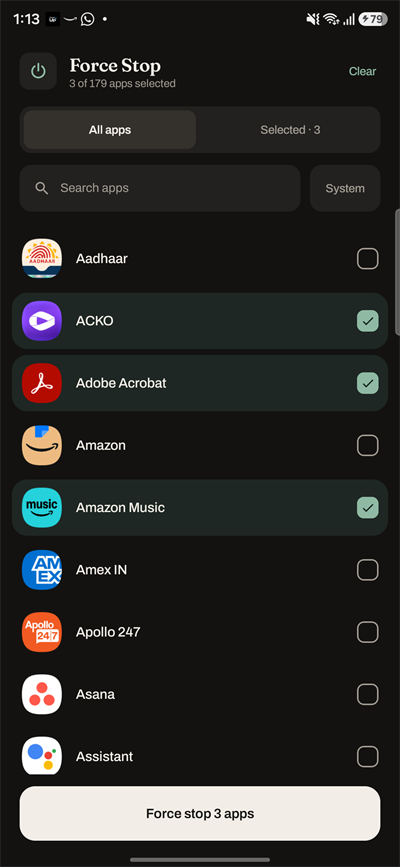
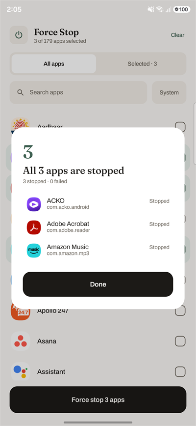
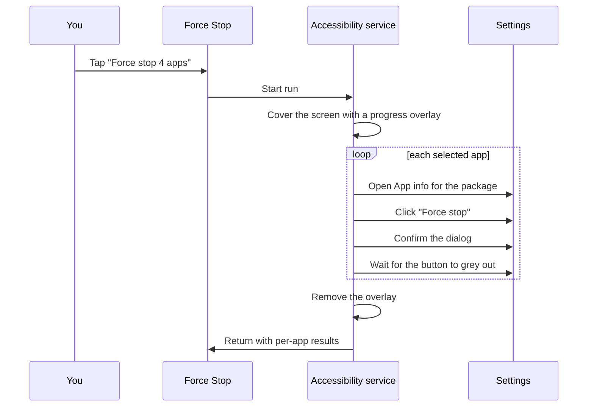

<div align="center">

# Force Stop

**One tap to force-stop the apps you rarely open.**

[](#requirements)
[](#development)
[](#development)
[](LICENSE)

<table>
<tr>
<td align="center"></td>
<td align="center"></td>
<td align="center"></td>
<td align="center"></td>
</tr>
<tr>
<td align="center"><sub>Pick your list</sub></td>
<td align="center"><sub>Light or dark</sub></td>
<td align="center"><sub>Runs behind an overlay</sub></td>
<td align="center"><sub>Per-app results</sub></td>
</tr>
</table>

</div>

---

## Why this exists

Some apps go quiet until you open them once, then start pushing notifications again for
weeks. Muting their notifications outright is too blunt — you still want to hear from them
when *you* choose to use them. The manual fix is Settings → Apps → *app* → **Force stop**,
repeated for every offender.

This app does exactly that, for a list you pick once, behind a single button.

> [!IMPORTANT]
> **Not on Google Play, and not a candidate for it.** Play's accessibility policy only
> permits accessibility services that assist users with disabilities. This one uses the API
> to drive Settings, which is a legitimate thing to do on your own device but is not a
> permitted use for a Play-distributed app. Build it and sideload it.

## Features

- **One tap, whole list.** Pick the apps once; the selection is remembered.
- **You never see Settings.** A full-screen overlay covers the run and names the app being
  stopped.
- **Honest results.** Per-app outcome afterwards, failures first, each with a reason.
- **Search by name or package**, with a separate tab for reviewing your saved picks.
- **Works in any language.** Button labels are read from the Settings app's own string
  resources rather than hardcoded.
- **Nothing leaves the device.** No `INTERNET` permission, no analytics, no backup.
- **Light and dark**, following the system setting.

## Requirements

| | |
| --- | --- |
| **Android** | 15 (API 35) or newer |
| **Settings package** | `com.android.settings` — effectively all mainstream Android ([other devices](#oem-skins-and-other-devices)) |
| **Permissions** | Accessibility service + display over other apps ([why](#setup)) |

Developed and tested on Samsung One UI.

## Install

No prebuilt APK is published, so build it yourself:

```bash
git clone https://github.com/Kumar-Ashwin-Hubert/android-forceclose.git
cd android-forceclose
./gradlew :app:assembleDebug
adb install -r app/build/outputs/apk/debug/app-debug.apk
```

Or open the project in Android Studio and hit **Run**.

## Setup

On first launch the app shows a **Finish setup** card listing whatever is still missing,
with a **Grant** button for each. The card disappears once both are granted.

| Permission | Why it's needed |
| --- | --- |
| **Accessibility service** | Settings → Accessibility → Force Stop. This is what reads the App info screen and presses the button. |
| **Display over other apps** | Android blocks background apps from launching activities. After the first app, Settings is in the foreground and this app isn't, so opening the next App info page would be refused. Holding `SYSTEM_ALERT_WINDOW` is a [documented exemption](https://developer.android.com/guide/components/activities/secure-bal) to that restriction. |

> [!TIP]
> Running `adb shell am force-stop dev.ashwin.forcestop` turns the accessibility service
> back off — Android disables the service of any package that gets force-stopped. Relaunch
> with `adb shell monkey -p dev.ashwin.forcestop -c android.intent.category.LAUNCHER 1`
> instead.

## Using it

Tick the apps you want, then tap the button at the bottom.

- **All apps** browses everything; **Selected** reviews your saved picks.
- **Search** matches app names and package names in either view. It never changes which
  apps the bottom button will stop.
- A **package name** appears under an app only when the name alone isn't enough — two apps
  sharing a label, or a search that matched the package rather than the name. System apps
  stay marked as such.
- **System** reveals system apps. Selected system apps stay visible even with the filter
  off.
- **Clear** clears the entire saved selection, including apps outside the current search.

After a run, results show **Stopped** and **Failed** counts with failures listed first.
Apps that were already stopped count as **Stopped**.

If a saved selection can't be read, the app offers **Retry** and blocks selection changes
and runs. A failed save keeps the last confirmed selection and offers **Reload selection** —
reload first, then repeat the change. Neither path overwrites unreadable data.

## How it works

There is no public API for stopping another app. `FORCE_STOP_PACKAGES` is
`signature|privileged`, so a normal app can never hold it. The usual ways around that are
root or Shizuku, both of which need setup outside the app. This takes the fourth route: an
accessibility service that presses the same button you would.



Attaching the overlay is best-effort: if it fails the run still proceeds, and you'll watch
it happen.

## Privacy and safety

An accessibility service can, in principle, read everything on screen. This one is
deliberately fenced in:

- **Settings-only processing, not an OS content sandbox.**
  `android:packageNames="com.android.settings"` in
  [`accessibility_service_config.xml`](app/src/main/res/xml/accessibility_service_config.xml)
  filters accessibility events, not access to window content. Android grants the service
  the capability to retrieve the active window, which can belong to another app. During a
  run, the code retrieves that root and checks its package before searching for or clicking
  controls; non-Settings roots are ignored. This is an application-level guard, not a
  system-enforced restriction on what the service could access.
- **Idle unless you start a run.** `onAccessibilityEvent` does nothing. The service acts
  only when the button is pressed.
- **No network.** The app declares no `INTERNET` permission. There is no analytics, no
  crash reporting, no remote config. Both fonts are bundled in the APK, not fetched at
  runtime.
- **No backup.** `allowBackup="false"`, and your selection stays on the device in local
  DataStore.

It also refuses to click anything it hasn't positively identified:

> [!WARNING]
> **`Uninstall` sits on the same row as `Force stop`.** So *that* button is located purely
> by matching its visible text, never by view id or screen position, where an OEM layout
> difference could land the tap one button over. The label is read out of the Settings
> app's own string resources, so it follows your device language — with a hardcoded English
> fallback if that lookup fails, which is the case most likely to break on a heavily skinned
> non-English device.

The confirmation dialog is the one exception: its OK button is found by the framework id
`android:id/button1` first, falling back to label matching. That id is an AOSP constant for
the positive button of a standard dialog, not a guess at a position.

## Limitations

- **Force stopping lasts until user interaction.** On Android 15 and newer, a stopped app
  should remain stopped until direct or indirect user action reactivates it, such as opening
  it. Do not expect pushes, alarms, or scheduled jobs to wake it automatically. Android 15
  also cancels its pending intents and disables its widgets until it is launched again.
  Reminders and background work can be interrupted; restoring canceled alarms depends on the
  app. Avoid selecting apps whose timely alerts you need. See
  [Android's stopped-state behavior](https://developer.android.com/about/versions/15/behavior-changes-all#stopped-state).
- **Runs are sequential**, because Settings shows one App info page at a time. Per-app cost
  depends on how fast your device settles; the timeouts in
  [`ForceStopAccessibilityService.kt`](app/src/main/java/dev/ashwin/forcestop/service/ForceStopAccessibilityService.kt)
  cap the worst case at roughly 14 seconds per app.
- **Success is inferred** from the Force stop button becoming disabled. On a skin that keeps
  it enabled, or that is unusually slow, you'll get `Tapped "Force stop" but the app never
  stopped` even though it may have worked.
- **System apps are hidden by default.** Force stopping the wrong system process can make
  the device misbehave until you reboot.

## Troubleshooting

### Logs

```bash
adb logcat -s ForceStop:V
```

### OEM skins and other devices

If your OEM hosts App info somewhere other than `com.android.settings`, add that package to
`android:packageNames` in
[`accessibility_service_config.xml`](app/src/main/res/xml/accessibility_service_config.xml)
and to the `<queries>` block in
[`AndroidManifest.xml`](app/src/main/AndroidManifest.xml).

Timing is tunable at the top of
[`ForceStopAccessibilityService.kt`](app/src/main/java/dev/ashwin/forcestop/service/ForceStopAccessibilityService.kt)
if your device animates slowly.

## Development

| | Version |
| --- | --- |
| Android Gradle Plugin | 9.4.0 |
| Gradle | 9.7.1 |
| Kotlin | 2.2.10 (via AGP's built-in Kotlin support) |
| compileSdk / targetSdk / minSdk | 37 / 36 / 35 |
| JDK | 17+ |

```bash
./gradlew :app:assembleDebug        # build
./gradlew :app:testDebugUnitTest    # unit tests
```

<details>
<summary><b>Project layout</b></summary>

<br>

| File | Role |
| --- | --- |
| [`ForceStopAccessibilityService.kt`](app/src/main/java/dev/ashwin/forcestop/service/ForceStopAccessibilityService.kt) | The run loop: opens each App info page, clicks, confirms, verifies |
| [`SettingsLabels.kt`](app/src/main/java/dev/ashwin/forcestop/service/SettingsLabels.kt) | Reads the real button labels from the Settings package, so it isn't English-only |
| [`NodeMatching.kt`](app/src/main/java/dev/ashwin/forcestop/service/NodeMatching.kt) | Accessibility node lookup helpers |
| [`RunOverlay.kt`](app/src/main/java/dev/ashwin/forcestop/service/RunOverlay.kt) | The full-screen progress panel |
| [`ForceStopController.kt`](app/src/main/java/dev/ashwin/forcestop/service/ForceStopController.kt) | Shared run state between service and UI |
| [`InstalledAppsRepository.kt`](app/src/main/java/dev/ashwin/forcestop/data/InstalledAppsRepository.kt) | Lists launchable apps |
| [`SelectionStore.kt`](app/src/main/java/dev/ashwin/forcestop/data/SelectionStore.kt) | Persists your picks |
| [`AppListScreen.kt`](app/src/main/java/dev/ashwin/forcestop/ui/AppListScreen.kt) | Compose UI, setup prompts, results |
| [`Theme.kt`](app/src/main/java/dev/ashwin/forcestop/ui/Theme.kt) | Authored light and dark palettes and the type scale |

</details>

<details>
<summary><b>Two things worth knowing if you fork this</b></summary>

<br>

The overlay was the fiddly part, and both problems are easy to lose an afternoon to:

1. **A `SYSTEM_ALERT_WINDOW` overlay cannot cover Settings.** Settings sets
   `HIDE_NON_SYSTEM_OVERLAY_WINDOWS` on its activities as anti-tapjacking protection — the
   overlay simply vanishes when App info opens. The fix is
   `AccessibilityService.attachAccessibilityOverlayToDisplay()`, which the flag doesn't
   apply to.
2. **Attaching an accessibility overlay does not show it.** `SurfaceControl` layers are
   created hidden, and the attach call only reparents. `SurfaceView.setChildSurfacePackage`
   calls `show()` for you; this path doesn't. Without an explicit
   `setVisibility(surface, true)` the attach succeeds, the surface is valid, and nothing
   renders.

</details>

<details>
<summary><b>Design notes</b></summary>

<br>

Colour is authored rather than dynamic, with separate light and dark palettes that follow
the system setting — so the app looks the same in a screenshot as it does on a phone.
Informative text meets WCAG AA contrast in both themes, and every interactive element
meets the 48dp minimum touch target.

Two variable fonts are bundled in `app/src/main/res/font`:

| Font | Used for |
| --- | --- |
| [Fraunces](https://github.com/undercasetype/Fraunces) | Wordmark, dialog headlines, the result count |
| [Archivo](https://github.com/Omnibus-Type/Archivo) | Everything else |

</details>

## Contributing

Issues and pull requests are welcome — particularly OEM compatibility reports, since this
depends on how your Settings app lays out App info. If you're filing a failed run, include:

- Device, Android version and skin
- The failure text from the results panel
- Output of `adb logcat -s ForceStop:V` for the run

## Acknowledgements

[Fraunces](https://github.com/undercasetype/Fraunces) and
[Archivo](https://github.com/Omnibus-Type/Archivo) are used under the
[SIL Open Font License 1.1](https://openfontlicense.org). Their license texts are included
in [`licenses/`](licenses/).

## License

[Apache License 2.0](LICENSE) © Kumar Ashwin Hubert
